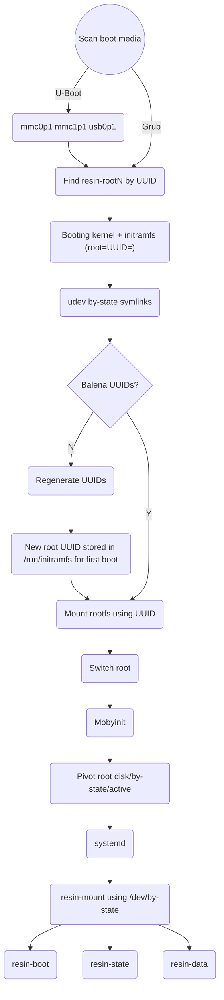

# `balenaOS` internals

## Filesystem labels and the transition to udev by-state links

`balenaOS` historically uses filesystem labels for defining mount targets. All these labels are important as there is a hard assumption in the OS that they exist and they have certain values for each partition. For setup configurations with multiple partitions with the same label, there is a race condition on the detection of these labels. This can happen for example in use-cases where a `balena` device burns a `balenaOS` image to other storage devices (see [etcher](https://www.balena.io/etcher/) for example). Booting the OS with multiple storage devices which have conflicting labels would most probably cause runtime issues.

In order to address this class of issues, two changes have been implemented in the OS:

* Re-generation of filesystem UUIDs to balena prefixed UUIDs
* Enforce mounting all partitions from the same disk, as specified by the bootloader which is considered the source of truth.

The OS still assumes the existence of the labels but relies on the bootloader to specify what disk to boot from by passing a `root=UUID=` kernel command line argument. When a `balenaOS` filesystem label is detected, udev checks whether it belongs to the same disk as the root partition UUID specified by the bootloader. Only if it does it goes and creates a by-state symlink.

By using these by-state symlinks, the system is assured to always mount all partitions from the boot drive as specified by the bootloader.

## Boot chart

